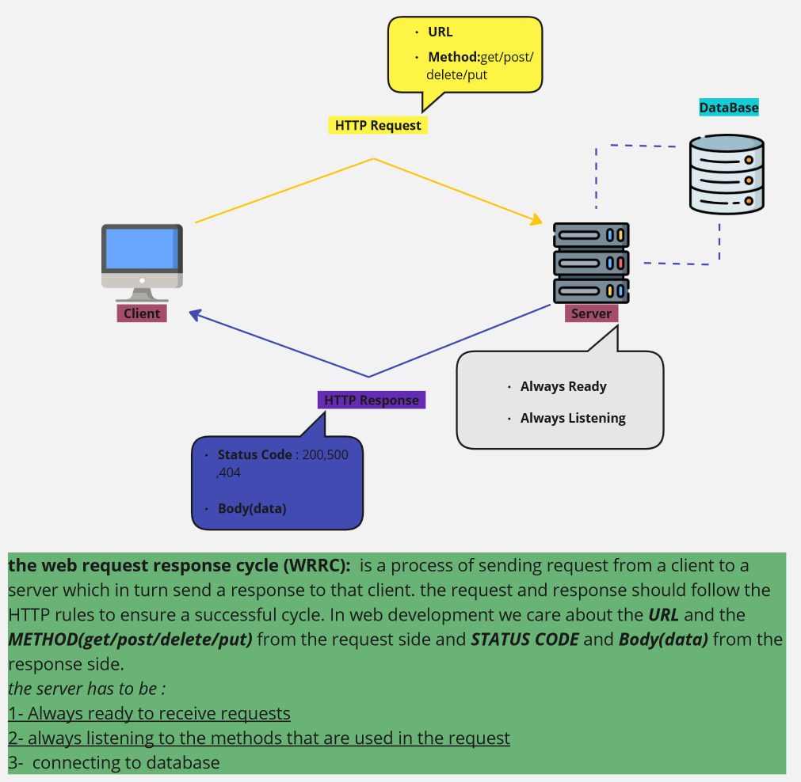

# MultiLab-Poject

## Project Name : Movies-Library
## Project Version : 1.0.0

## Author Name: Anas Knbar

### WRRC 

## Overview
this is going to be my firt website that I will build from scratch, in this project I will deal with the back end environment for the first time and discove how back-end side works. in this part of the course I will deal with new technologies including react,node.js,expree,databases and so on.

## Getting Started
<!-- What are the steps that a user must take in order to build this app on their own machine and get it running? -->
- we will start by setting up the backend-web side starting by bulding a server using node.js and express.
- then we will deal with the website's database and use APIs that will help us in the website
- after that we will move to the front end and bulding the user interface using HTML,CSS, and JS more over we are going to use REACT as js framework for the first time 
  

## Project Features
<!-- What are the features included in you app -->
this website will have a resposive pages and uptodate movie library where the user can navigate to differente section which includes (drama,romance,historic, scific...etc movies )
also the user can add its favorate move to a list to watch them later.

# Lab13:
in this lab we add data base to our project, where we can get and post data from it.
we also learn bunch of command to deal with the data base
- sqlstop >> stop the DB
- psql >> enter your default DB
- \l >> list all my data base
- \d >> to last my tables

- CREATE DATABASE databasename ; >> to create data base
- CREATE TABLE tablename (
      column1 datatype,
      column2 datatype,
      column3 datatype,
      ....... 
)

- psql -d mydb -f nameOfSchemaFile >> you have to be in the same directory that has the schemafile

INSERT INTO table_name
VALUES (value1, value2, value3, ...); >> provide the struct of the data table

SELECT * FROM tableName >> to list the table data

# lab14

- in this lab we continue working on our project by implementing two more new method which 
are PUT and DELETE and complete the full cycle of our CRUD methods

- also we use get method with id to retrive specific data from the database 

- we learn addition sql statment i.e >> ALTER, DELETE, UPDATE ..etc

